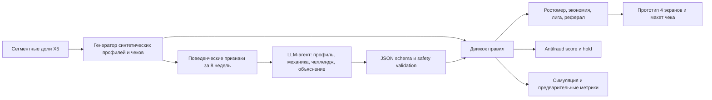

# «Растём вместе» — описание проекта, промежуточная версия

Дата среза: 04.09.2026, до промежуточного чек-поинта  
Статус: продуктовая концепция и техническая спецификация сформированы; программный proof of concept находится в разработке

## Краткая аннотация

«Растём вместе» — персональный игровой слой программы лояльности X5 для пользователей мобильного приложения из сегмента семей с детьми до трёх лет. Общий цифровой «ростомер семьи» растёт от регулярных покупок, подтверждённой экономии и покупки уценённых продуктов, которые иначе могли бы быть списаны. LLM-агент анализирует синтетическую историю чеков, определяет поведенческий профиль, выбирает первую механику и составляет недельный челлендж. Детерминированный движок отдельно рассчитывает экономию, прогресс, место в лиге, реферальный статус и antifraud-score.

Решение должно увеличить частоту покупок и долю кошелька X5 без постоянной раздачи дополнительных скидок. Награда в MVP преимущественно немонетарная: статус, прогресс семьи и персональный блок на кассовом чеке.

## Проблематика

В приложениях X5 уже есть баллы, скидки и отдельные игры, но они не образуют долгосрочный персональный цикл между покупками. По словам представителя X5 на Q&A, существующие игры имеют слабый retention: участие требует времени или траты накопленного кешбэка, а выпавшая награда может быть нерелевантна пользователю.

Для бизнеса недостаточно увеличить оборот промораздачей: рост должен сохранять маржу и EBITDA. Для пользователя механика должна возвращать один из дефицитных ресурсов — деньги, время или усилия, — а не становиться ещё одной обязанностью.

## Актуальная постановка задачи

Для выбранного сегмента нужно связать в один сценарий:

1. личный прогресс и цифровой аватар;
2. персональный челлендж из истории покупок;
3. лигу сопоставимых пользователей;
4. реферальную механику с отложенной квалификацией;
5. объяснимые правила начисления и antifraud;
6. оценку экономики и план реального пилота.

Хакатонный POC использует синтетические транзакции. Доли клиентских сегментов калибруются по агрегированным данным, предоставленным кейсодателем; поведение, чеки, uplift и fraud patterns являются модельными и маркируются как допущения.

## Пользователь и выбранный сегмент

Первичный пользователь — взрослый, ведущий домохозяйство с ребёнком до трёх лет и использующий приложение X5. По данным кейсодателя, этот сегмент составляет 26% пользователей приложения Пятёрочки, 26% Перекрёстка и 28% Чижика и перепредставлен в мобильном приложении относительно потока гостей.

Выбор сегмента остаётся продуктовой гипотезой: высокая доля в приложении подтверждает доступность аудитории, но не доказывает запас роста частоты или интерес к механике. Критическое допущение — такие семьи распределяют продуктовые покупки между несколькими сетями, поэтому X5 может увеличить свою долю кошелька.

Второй пользователь — продакт или маркетолог X5. Ему нужны причина выбора механики, стоимость награды, ожидаемый эффект и сигналы подозрительной активности.

## Ценностное предложение

### Для пользователя

- увидеть подтверждённую экономию из фактического чека;
- получить достижимую недельную цель, связанную с привычной корзиной;
- вести единый семейный прогресс с покупок нескольких взрослых;
- участвовать в лиге сопоставимых семей, не раскрывая имя, адрес и сумму трат;
- получать эмоциональную награду без требования тратить кешбэк на игровые жизни.

### Для X5

- управлять частотой и долей кошелька без неконтролируемого роста скидочного бюджета;
- переводить часть близких к списанию товаров в продажу;
- выбирать механику на уровне поведения пользователя;
- получить измеримый контур для A/B-пилота;
- снизить злоупотребления правилами лимитов, hold и antifraud-score.

## Выбранное техническое решение

### Разделение ответственности

- LLM классифицирует поведенческий тип, выбирает из разрешённых механик, формулирует и объясняет челлендж.
- Числа, ограничения, исключённые категории, награды и antifraud рассчитываются обычным кодом.
- Выход LLM проходит структурную и бизнес-валидацию; при ошибке используется шаблонный fallback.
- Синтетическая симуляция иллюстрирует механику и проверяет непротиворечивость правил, но не доказывает реальный uplift.

## Механики MVP

1. **Ростомер семьи.** Прогресс растёт от покупочных недель, выполненного челленджа и спасённых продуктов. Нет штрафов и потери прогресса.
2. **Лига «своих».** 20–50 анонимных семей одного сегмента/сети/крупного географического бакета; основная метрика — процент подтверждённой экономии. При малой когорте рейтинг не показывается.
3. **«Экономия в подарок».** Реферал квалифицируется только после первого неотменённого чека приглашённого; награда удерживается 72 часа.

Дополнительный экономический сценарий — «Спаси продукт»: пользователь подписывается на релевантные категории уценки. Детское питание, заменители грудного молока, алкоголь и табак исключаются.

## Что уже выполнено

На момент этого среза завершены:

- разбор исходного кейса и полного Q&A с представителем X5;
- фиксация бизнес-ограничений и предварительного дерева метрик;
- выбор сегмента и основной концепции;
- анализ существующих игр X5 и внешних аналогов;
- спецификация пользовательского сценария, четырёх экранов и правил v0;
- схема синтетических данных и JSON-контракт LLM-агента;
- спецификация симуляции, антифрода и end-to-end демо;
- реестр продуктовых рисков, открытых вопросов и отвергнутых гипотез;
- предварительная сценарная экономика;
- брифы для двух ML-контуров.

## Что пока не реализовано

В текущей папке на 04.09 отсутствуют и не должны называться готовыми:

- исполняемый генератор и CSV синтетических данных;
- код LLM-агента и результаты challenge eval;
- движок правил и автоматические тесты;
- результаты симуляции и графики;
- кликабельный прототип и макет чека;
- единая команда `run_demo.py`;
- подтверждённые интервью с целевыми пользователями;
- экспериментальное доказательство роста частоты.

Эти компоненты находятся в работе по брифам `briefs/ML1.md` и `briefs/ML2.md`. Раздел нужно обновить перед загрузкой, если файлы появятся.

## Предварительные результаты

### Подтверждённые входы

- Семьи с детьми до трёх лет составляют 26–28% пользователей мобильного приложения в трёх сетях X5 по агрегированным данным кейсодателя.
- Кейсодатель подтвердил необходимость считать оборот, маржу и EBITDA, а не только engagement.
- Для рассмотрения пилота нужен потенциальный эффект порядка десятков миллионов рублей в месяц и адекватный ROI.
- Синтетические данные разрешено калибровать по агрегатам X5 и открытым источникам, не ожидая внутреннюю транзакционную выборку.

### Сценарные расчёты, не измеренный эффект

- При 1 млн вовлечённых семей, четырёх покупках в месяц, среднем чеке 500 ₽ и относительном росте частоты на 2% модель даёт около **40 млн ₽ дополнительного оборота в месяц**.
- При валовой марже 20% верхняя оценка дополнительной валовой маржи — около **8 млн ₽**, то есть порядок допустимой награды — единицы рублей на вовлечённого пользователя в месяц.
- Если 10% из условных 600 млн ₽ ежемесячных списаний удаётся реализовать с дисконтом 50%, грубая модель восстановления стоимости даёт до **37,5 млн ₽ улучшения** до учёта каннибализации и операционных расходов.

Все результаты выше чувствительны к охвату, MAU, частоте, марже, фактической доле списаний и замещению продаж по полной цене. Это сценарии для проверки, а не прогноз X5.

## Ограничения и основные риски

- Перепредставленность сегмента в приложении не доказывает его экономический headroom.
- Привязка к этапам ребёнка может восприниматься как манипулятивная; этап задаёт взрослый добровольно, отключение доступно в один тап, коммуникация адресована родителю.
- «Эмоциональная» награда может оказаться недостаточной без материальной выгоды.
- Уценка может каннибализировать продажи по полной цене.
- Печать игрового блока на кассовом чеке технически и экономически не подтверждена.
- Синтетические результаты легко подогнать; поэтому в них не закладывается доказанный uplift.
- Процент экономии требует доверенного reference price и точного расчёта.
- Общая карта нескольких взрослых и детские этапы требуют отдельной проверки приватности.
- Рейтинг может демотивировать отстающих; нужен opt-in, сопоставимые когорты и персональный режим.

## Открытые вопросы

1. Как X5 определяет клиентские сегменты и доступны ли их признаки в момент показа?
2. Что именно означает эффект «1–2 п.п.»: относительный рост транзакций или рост доли пользователей, пересёкших N покупок?
3. Каковы MAU, базовая частота и доля кошелька семей по сетям?
4. Есть ли у X5 собственная поведенческая сегментация, которую можно использовать вместо трёх модельных типов?
5. Какова каннибализация продажи уценки и фактическая стоимость списаний?
6. Какую contribution margin использовать для reward cap, не смешивая gross margin и net profit?
7. Поддерживают ли кассовые системы динамическую графику/текст и какова предельная стоимость блока на чеке?
8. Достаточна ли ценность статуса без денежной награды?
9. Какой владелец и минимальный артефакт нужны для перехода к реальному пилоту?

## План до финальной версии

1. Реализовать и проверить генератор синтетических профилей и чеков.
2. Реализовать constrained LLM-agent и schema validation.
3. Провести eval релевантности минимум на 30 профилях и показать худшие примеры.
4. Реализовать правила экономии, прогресса, лиги, реферала и antifraud с тестами.
5. Запустить симуляцию на 1–10 тыс. пользователей и выпустить CSV/графики с явными допущениями.
6. Собрать кликабельный прототип четырёх экранов и макет чека.
7. Провести 5–8 коротких интервью/концепт-тестов с родителями и обновить гипотезы.
8. Пересчитать экономику в нескольких сценариях, включая каннибализацию.
9. Собрать end-to-end demo и резервную запись.
10. Зафиксировать план A/B-пилота и получить обратную связь кейсодателя.

## Команда и распределение задач

Перед загрузкой необходимо заменить обозначения ML-1/ML-2 на имена и указать фактический вклад, а не только назначенную ответственность.

| Участник | Роль | Зона ответственности | Выполнено к текущему срезу | Текущая степень участия |
|---|---|---|---|---|
| Иван | Product Manager | Проблема, концепция, экономика, исследования, документы, коммуникация с кейсодателем, план пилота | Контекст-пак, выбранная ставка, сценарные расчёты, брифы и план чек-поинта | Активно; точный процент команда указывает сама |
| **[Имя ML-1]** | ML Engineer — данные и AI-ядро | Синтетические профили и чеки, LLM-agent, объяснение механики, relevance eval | **[Заполнить только фактически выполненные файлы]** | **[Высокая/средняя/низкая или %]** |
| **[Имя ML-2]** | ML/Product Engineer — правила и симуляция | Rules engine, leaderboard, referral, antifraud, simulation, prototype integration | **[Заполнить только фактически выполненные файлы]** | **[Высокая/средняя/низкая или %]** |

## Использование AI

AI применялся для структурирования транскриптов, расширения и критики пространства идей, desk research аналогов, моделирования возражений синтетического user board, подготовки технических контрактов и аудита материалов. Люди оставили за собой выбор сегмента и концепта, экономические допущения, коммуникацию с кейсодателем и финальную ответственность за выводы. Подробности — в `AI_LOG.md`.

## Связанные материалы

- `CONCEPT.md` — продуктовая и функциональная спецификация.
- `CONTEXT_PACK.md` — факты, гипотезы, источники и решения.
- `PRODUCT_BRIEF.md` — компактная продуктовая проработка.
- `CHECKPOINT_PLAN.md` — план работ и критерии сдачи.
- `DEMO.md` — контракт будущего end-to-end демо.
- `ADDITIONAL_MATERIALS.md` — индекс дополнительных артефактов и их статус.
