# Idea Maze: игровой слой лояльности X5 для семей с детьми до 3 лет

**Дата:** 2026-09-03
**Метод:** Idea Maze (Balaji Srinivasan) — desk research по открытым источникам, веб-поиск
**Статус:** desk research, требует верификации (часть данных — вторичные источники и агрегаторы, часть цифр X5 — из пресс-релизов и деловых СМИ, не из первички)

---

## 1. Вход в лабиринт

**Идея одной фразой:** игровой слой поверх программы лояльности X5 (Пятёрочка/Перекрёсток/Чижик) для семей с детьми до 3 лет — аватар-ростомер семьи растёт от покупок, экономии и «спасённых» уценённых товаров; ИИ собирает еженедельный челлендж из истории чеков и этапа развития ребёнка; есть лига «своих» по проценту экономии; вехи печатаются на кассовом чеке. Награда — статус и эмоция, а не скидка.

**Core job to be done:** вести домохозяйство с маленьким ребёнком быстро, дёшево, без потери качества — то есть управлять неопределённостью (что нужно ребёнку на этом этапе), временем (нет ресурса разбираться) и деньгами (высокая чувствительность к цене в категории, где нельзя экономить на качестве) одновременно.

Важный терминологический нюанс: у X5 «покупатели» и «пользователи приложения» — разные величины. X5 Media в 2024 г. заявляла охват «более 80,5 млн клиентов» суммарно по Пятёрочке, Перекрёстку, Vprok.ru, 5Post, Food.ru и X5 Blogger [X5 Group, июль 2024, x5.ru] — это рекламный охват экосистемы, а не число активных пользователей программы лояльности. Отдельно у Пятёрочки называется MAU приложения «21+ млн» в контексте геймификационных кейсов [sostav.ru/Habr, 2025] — это ближе к реальной аудитории, на которую ложится игровой слой.

---

## 2. Топография лабиринта — стратегические ветви геймификации в ритейл-лояльности (с ~2000 г.)

```mermaid
graph TD
  ROOT["Геймификация и вовлечение<br/>в ритейл-лояльности (~2000–2026)"]

  ROOT --> B1["Ветвь 1:<br/>Балльные/уровневые программы"]
  B1 --> B1a["Tesco Clubcard (1995→)<br/>двойной рост доли рынка за 3 года<br/>[Marketing Week, thegrocer.co.uk]"]
  B1 --> B1b["Nectar (2002→)<br/>коалиция 500+ брендов, 23 млн участников (2025)<br/>[Wikipedia/Grokipedia]"]
  B1 --> B1c["Starbucks Rewards (2009→)<br/>звёзды, тиры, 75+ млн участников (2024),<br/>57% продаж США — от участников<br/>[stampme.com, rivo.io]"]

  ROOT --> B2["Ветвь 2:<br/>Физический коллекционинг<br/>(наклейки/фигурки)"]
  B2 --> B2a["McDonald's Monopoly (1987→)<br/>фрод на $24 млн, 1989–2001,<br/>арест 2001, HBO 'McMillions'<br/>[CNBC 2020]"]
  B2 --> B2b["Panini WM-стикеры в Lidl/REWE (Германия, ЕС)<br/>980 наклеек, ЧМ-2026<br/>[mydealz.de, ms-aktuell.de]"]
  B2 --> B2c["Albert Heijn (NL): футбольные наклейки,<br/>тематические мини-коллекции (Disney и др.)<br/>[маркетплейс-агрегаторы]"]
  B2 --> B2d["Дикси 'Прилипалы' (с 2015, волны до 2022+)<br/>[fandom, hullabaloo.ru]"]
  B2 --> B2e["Магнит 'Скрепыши' (авг–окт 2019, повтор 2021+)<br/>обвинения в манипуляции детьми<br/>[irecommend.ru, gubdaily.ru]"]
  B2 --> B2f["Пятёрочка: Йокими (2026), Lego-акции,<br/>наклейки за 300₽ покупки<br/>[amic.ru, proactions.ru]"]

  ROOT --> B3["Ветвь 3:<br/>In-app мини-игры ритейла/маркетплейсов"]
  B3 --> B3a["Пятёрочка/Перекрёсток: 'Холодильник выгоды'<br/>(X5 Клуб), 'Космос рядом',<br/>конвейер сезонных игр<br/>[x5club.ru, sostav.ru]"]
  B3 --> B3b["Самокат: Telegram-боты →<br/>'Скидкотека' (танцпол, квартира,<br/>2,5 млн танцев) → 'Пандагочи'<br/>(17 фев 2025, тамагочи-панда)<br/>[sostav.ru, e-pepper.ru]"]
  B3 --> B3c["Магнит: 'Играй, лето продлевай!' (2024,<br/>тамагочи-пёс Пельмень)<br/>[sostav.ru]"]
  B3 --> B3d["Ozon 'Морковск' (июнь 2025):<br/>розыгрыш квартиры, вовлечённость<br/>'в 10 раз выше баллов' (заявлено)<br/>[oborot.ru]"]
  B3 --> B3e["SPAR 'Zuuum' (2020→постоянно):<br/>139 512 игроков, 1,16 млн игр<br/>[sostav.ru]"]

  ROOT --> B4["Ветвь 4:<br/>Геймификация банковских экосистем<br/>(смежный, но конкурентный слой внимания)"]
  B4 --> B4a["СберСпасибо: уровни (2018),<br/>'Спасибомания', 'СберПраймСити'<br/>(444 тыс. участников за 6 мес)<br/>[gamification-now.ru]"]
  B4 --> B4b["Т-Банк: квестовые задания,<br/>'Магия отпуска' (лето 2024, раннер),<br/>кешбэк игровым временем c Colizeum (2026)<br/>[kommersant.ru]"]

  ROOT --> B5["Ветвь 5:<br/>Streak/привычка (не ритейл изначально)"]
  B5 --> B5a["Duolingo streaks:<br/>32 млн DAU со стриком 7+ дней,<br/>'главный рычаг retention'<br/>[deconstructoroffun.com]"]
  B5 --> B5b["Перенос в ритейл: адвент-календари,<br/>ежедневные офферы ('Поезд подарков',<br/>Пятёрочка 2023) — прямых количественных<br/>кейсов streak-механики в ритейле РФ не найдено (гипотеза)"]

  ROOT --> B6["Ветвь 6:<br/>Локационные игры + спонсируемые точки"]
  B6 --> B6a["Pokémon Go (2016):<br/>Sprint (дек 2016, 10 500+ точек),<br/>Starbucks (дек 2016, 12 800+ точек),<br/>McDonald's Japan; self-serve для SMB<br/>приостановлен<br/>[PYMNTS, TechCrunch]"]

  ROOT --> B7["Ветвь 7:<br/>Детско-родительские программы<br/>(вертикаль, близкая к нашей идее)"]
  B7 --> B7a["Pampers Club/Rewards (глобально):<br/>баллы за упаковки, скан чеков,<br/>трекинг развития малыша + советы<br/>[Google Play, amworldgroup.com]"]
  B7 --> B7b["Детский мир (РФ): бонусы 2–5%,<br/>500 бонусов на ДР ребёнка (до 12 лет)<br/>[corp.detmir.ru, kuponika.ru]"]

  ROOT --> B8["Ветвь 8:<br/>Печать/эмоция на физическом носителе (чек)"]
  B8 --> B8a["Drinkit: печать фото на чеке —<br/>ритуал, чек 'не хочется выбрасывать'<br/>[vc.ru, 2024]"]
  B8 --> B8b["Додо Пицца: AR-маска в Instagram,<br/>'додокоины' пока ждёшь заказ,<br/>скан чеков в конкурсах (48 ч, 1/день)<br/>[gamification-now.ru]"]
```

**Дополнительно к брифу (Habr «Банк как игровая площадка»)**: авторы прямо формулируют тезис, что после 2022 г. банки в РФ потеряли часть традиционных каналов охвата и превратили собственные приложения в «игровые площадки» как альтернативное пространство диалога с клиентом [habr.com/ru/articles/1018528, 2025-2026] — структурно та же логика применима к ритейл-приложениям, конкурирующим за внимание в семье.

---

## 3. Ямы и тупики (провалы и почему)

### 3.1. McDonald's Monopoly — фрод изнутри дистрибуции (1989–2001)
Джером Джейкобсон, глава службы безопасности подрядчика Simon Marketing, отвечавшего за распространение выигрышных фишек, похищал крупные призовые стикеры и передавал их сообщникам вместо честного распределения. По оценке следствия, похищено около $24 млн; ФБР провело расследование с 2000 г., в том числе инсценировав рекламный ролик, чтобы получить признания в кадре; аресты — август 2001 г., осуждено более 50 человек [CNBC, 2020-02-07]. **Урок:** любая механика с «редкими призами» создаёт точку концентрированного риска — не только фрод игроков (как в McDonald's Monopoly фрод шёл со стороны оператора/дистрибьютора), но и инсайдерский риск на стороне того, кто печатает/выдаёт выигрышные экземпляры. Для схемы с печатью вех на чеке и «редкими» уценёнными позициями это прямая аналогия: если игра завязана на редкость физического инвентаря (акционные товары, лимитированные позиции), нужен контроль цепочки поставки самого «выигрыша», а не только антифрод на стороне покупателя.

### 3.2. Магнит «Скрепыши» — обвинения в манипуляции детьми и экологический бэклэш (2019, повторы 2021+)
Акция (14 августа – 13 октября 2019, позже повторялась) вызвала выраженную негативную реакцию: в СМИ и отзывах кампанию описывали как «зомбирующую детей», которые соревнуются со сверстниками за количество игрушек, а родителей — как вынужденных совершать отдельные походы в магазин под давлением ребёнка [gubdaily.ru; irecommend.ru, 2019-2020]. Отдельный пласт критики — экологический (пластиковый мусор, отзывы «тонны бесполезного пластика») [irecommend.ru]. **Урок:** механики, ориентированные на ребёнка как на канал влияния на решение родителя о покупке, попадают под прямой конфликт с нормами закона «О рекламе» (см. п.4) и с общественной чувствительностью к «эксплуатации детей» в маркетинге — это системный риск именно для сегмента «семьи с детьми», в котором работает наша идея. Юридически в РФ ст. 6 закона «О рекламе» (38-ФЗ, 2006) прямо запрещает рекламу, которая формирует у детей чувство неполноценности без товара, создаёт впечатление превосходства над сверстниками, побуждает уговаривать родителей на покупку [consultant.ru]. Игровой слой, где ребёнок (или его «рост в приложении») становится инструментом мотивации родителя тратить/делать покупки чаще, должен быть спроектирован так, чтобы обращение оставалось к родителю, а не создавало давление «через ребёнка» — иначе повторяет ошибку «Скрепышей».

### 3.3. Игры X5 с retention около нуля («Холодильник выгоды», «Космо Кафе») — ограниченные жизни за кэшбэк, нерелевантная награда
Из брифа кейсодателя: retention у существующих игр X5 около нуля из-за (а) искусственного ограничения «жизней», докупаемых за баллы/кэшбэк, и (б) награды в виде нерелевантной скидки. Внешние отзывы о «Холодильнике выгоды» подтверждают механику ограниченного бесплатного доступа («бесплатный ежедневный доступ... нужно кликать по всему, кроме фейерверков, иначе — потеря») и разнородные призы (от баллов до бытовой техники) [irecommend.ru, otzovik.com] — то есть внешние источники не опровергают тезис кейсодателя о слабой ценностной согласованности награды, хотя количественных данных retention в открытом доступе нет (данные кейсодателя не были независимо верифицированы — **(гипотеза о нулевом retention принимается на основании внутренних данных кейсодателя, не публичного источника)**). **Урок:** это ключевая яма, которую наша идея должна явно обойти — награда за игру должна быть эмоционально/статусно релевантна (наш тезис «статус, не скидка»), а не отчуждена от смысла действия.

### 3.4. Ловушки, действующие до сих пор
- **Усталость от чрезмерных челленджей (Starbucks).** Источники фиксируют, что геймификация Starbucks (Double Star Days, Bonus Star Challenges) даёт измеримый эффект вовлечённости, но есть широко обсуждаемая в индустрии проблема «челлендж-усталости» и обесценивания программы частыми пересмотрами условий (после реформы марта 2026 введены три тира) [markhub24.com; общий индустриальный консенсус]. Прямая количественная метрика оттока от усталости в открытых источниках не найдена — помечаем как **(гипотеза, широко цитируемая в индустрии, но не подтверждённая конкретным источником с цифрами)**.
- **Экологический / «мусорный» бэклэш физического коллекционинга** — актуален и для Дикси «Прилипалы», и для Магнит «Скрепыши»: часть аудитории воспринимает пластиковые фигурки как одноразовый мусор [irecommend.ru]. Для нашей идеи это довод в пользу цифрового аватара (не физического инвентаря) как основного носителя статуса.
- **Регуляторный риск рекламы детям** сохраняется и ужесточается: с 2024–2025 в РФ действуют новые требования к маркировке возрастного контента (0+/6+ и т.д.) и ограничения по рекламе у детских учреждений (100 метров) [ФАС, fas.gov.ru; delo-press.ru]. Это не разовая яма 2019 года, а постоянно действующий периметр ограничений.

---

## 4. Новые двери (сдвиги, открывающие идею именно сейчас)

1. **LLM-персонализация челленджей** — технологически стало практично собирать еженедельный челлендж из истории чеков конкретной семьи с учётом этапа развития ребёнка; это структурно новый примитив относительно механик 2019–2024 гг. (Скрепыши, Холодильник выгоды), которые были статичными кампаниями без персонализации на уровне LLM. Прямых кейсов «LLM генерирует персональный ритейл-челлендж по чекам» в открытых источниках не найдено — **(гипотеза: рынок ещё не занял эту нишу, датировать точно нельзя)**.
2. **Retail media как источник финансирования и данных.** Объём рекламных услуг X5 (X5 Media) достиг ~20 млрд ₽ за 2024 г. и ~19,7 млрд ₽ за 9 месяцев 2025 г., рост во II кв. 2026 г. — в 1,5 раза год к году, до 9,6 млрд ₽ за квартал; число цифровых поверхностей выросло на 45% [new-retail.ru, 2025; adindex.ru, 2025-2026]. Это означает, что у X5 есть растущая инфраструктура персонализированной коммуникации (и бюджет), в которую логично встраивать игровой слой без создания отдельной статьи затрат.
3. **Печать на фискальных чеках как канал эмоции, не купона.** Кейс Drinkit (фото на чеке, 2024) показывает рабочий прецедент: чек как «то, что не хочется выбрасывать» [vc.ru, id161239, 2024]. Это прямая опора для механики «вехи печатаются на кассовом чеке» — уже не гипотетическая, а технически подтверждённая на практике (хотя и не в масштабе сети из тысяч касс, а в кофейне).
4. **Динамика уценки/списаний в ритейле РФ.** Кейсодатель называет ~600 млн ₽/мес списаний в X5. Открытые источники (RBC, Retail.ru, Kommersant за 2024-2025) фиксируют общий тренд trading down и рост чувствительности к цене, но конкретной публичной цифры по объёму списаний/уценки X5 или доле уценённых товаров в открытых источниках найти не удалось — **(данные кейсодателя не верифицированы независимым источником, помечаем как внутренние/непроверенные)**.
5. **Прирост сети и клиентской базы X5.** Число магазинов выросло с 27 015 (конец 2024) до 29 790 (конец 2025), рост ~10%; число покупателей выросло на 8,3% [kommersant.ru, 2026]. Это расширяющаяся база для пилота, но также сигнал, что органический рост сети сам по себе не решает проблему вовлечённости в приложение — отсюда и интерес кейсодателя к игровому слою.

---

## 5. Позиционирование конкурентов сегодня — где кто стоит

| Путь в лабиринте | Кто занимает | Что уже занято | Белое пятно |
|---|---|---|---|
| Балльные/уровневые программы | Tesco Clubcard, Nectar, Starbucks Rewards, X5 Club | Массовый охват, накопление и обмен баллов — зрелый, коммодитизированный путь | — |
| Физический коллекционинг | Магнит «Скрепыши», Дикси «Прилипалы», Пятёрочка (Йокими, Lego), Lidl/Panini, Albert Heijn | Сезонные кампании, репутационный и экологический риск изучен | — |
| In-app мини-игры «казуальные» | Пятёрочка (конвейер: «Магазин сокровищ», «Поезд подарков», «Дачный участок»), Самокат («Скидкотека», «Пандагочи»), Магнит (Пельмень), Ozon «Морковск», SPAR Zuuum | Активно развивается именно сейчас (2023–2026), формат «тамагочи» уже опробован Самокатом на всём приложении (не сегментировано по семьям с детьми) | Сегментация под конкретный жизненный этап семьи (0–3 года) нигде не реализована как ядро механики |
| Банковская геймификация | СберСпасибо, Т-Банк | Конкурируют за то же внимание пользователя вне ритейл-контекста | — |
| Детско-родительские программы | Pampers Club (глобально), Детский мир (РФ) | Баллы за категорию товаров, привязка к возрасту ребёнка (Детский мир — до 12 лет, бонус на ДР) | Ни одна не связывает **весь продуктовый чек семьи** (не только детские товары) с развитием ребёнка и статусной игрой; Pampers/Детский мир — про товарную категорию, не про продуктовую корзину домохозяйства целиком |
| Печать на чеке | Drinkit (эмоция/фото), Додо (промо-скан) | Единичный, не сетевой масштаб; не связано с вехами лояльности | Печать вех программы лояльности (не просто фото) на кассовом чеке сети из тысяч магазинов — не встречено |
| Лига/рейтинг по метрике эффективности (не по тратам) | Общие механики leaderboard в фитнесе, геймификационных платформах | Существует как общий паттерн (топ-10, «вы лучше 10% пользователей») | Лига по **проценту экономии** (а не по сумме потраченного/накопленных баллов) — инверсия обычной механики «больше потратил — выше статус»; такого прямого кейса в ритейле не найдено |

**Вывод по белому пятну:** большинство конкурентов занимают либо (а) универсальную геймификацию всей аудитории ритейлера без сегментации по жизненному этапу семьи, либо (б) узкую детскую товарную категорию (подгузники, игрушки) без связи со всей продуктовой корзиной и без статусной механики через экономию. Пересечение «весь чек семьи + этап развития ребёнка + статус за экономию/спасение уценки + физическая печать вех» не встречается как готовый продукт ни у одного изученного игрока.

---

## 6. Путь к сокровищу

### Основной путь (ставка)
Сделать игровой слой не «ещё одной игрой в приложении», а **ритуалом статуса домохозяйства**, завязанным на три источника данных, которых нет у конкурентов в такой комбинации: (1) история чеков всей семьи (не одной категории), (2) этап развития ребёнка (возраст 0–3 — период максимальной неопределённости и частоты решений), (3) факт «спасения» уценённого товара (ESG/экономность как статусный сигнал, а не стыд). Ключевая ставка: **награда = социальный статус и печатный артефакт (чек), а не скидка** — это прямая инверсия механики «Холодильника выгоды» и большинства игр X5, где награда — купон.

Вехи:
- Неделя 1–2: валидация гипотезы «печать на чеке = эмоция», используя прецедент Drinkit, но на масштабе одного пилотного магазина/кластера X5.
- Неделя 3–4: ИИ-генерация еженедельного челленджа из чеков + этапа ребёнка — MVP на ограниченной когорте (родители с детьми 0–3, подписанные на карту лояльности с профилем ребёнка).
- Неделя 5–8: лига «своих» по проценту экономии внутри когорты, без публичного разглашения сумм трат (важно для приватности и избежания эффекта «зависти/стыда», который был частью критики «Скрепышей» — там сравнение шло между детьми).

Необходимые ресурсы: доступ к обезличенным данным чеков и профилю «ребёнок 0–3» в X5 Club, интеграция с фискальными принтерами для печати графики/текста вехи, бюджет на пилот в ограниченном числе магазинов, юридическая проверка механики на соответствие ст. 6 закона «О рекламе» (маркировка, отсутствие давления через ребёнка).

### Запасной путь
Если печать на чеке технически/юридически не масштабируется быстро (фискальные принтеры сети разнородны, вехи на чеке могут конфликтовать с требованиями ОФД к формату чека), — сдвинуть физический артефакт на push/экран приложения с опциональной печатью по запросу (как у Drinkit — по клику), сохранив ядро: ИИ-челлендж + аватар-рост + лига по экономии, без обязательной интеграции в кассовый поток на старте.

### Честная оценка новизны нашей ставки
- **Что действительно новое:** (1) связка «весь чек семьи + этап ребёнка + ИИ-персонализация челленджа» — комбинации не найдено ни у одного изученного игрока; (2) статус за экономию/спасение уценки как основная валюта (не скидка) — инверсия относительно McDonald's Monopoly, Скрепышей, Холодильника выгоды, где награда всегда материальна или количественна; (3) печать вех (не промокода, не рекламы) на чеке в масштабе сети — за пределами единичного прецедента Drinkit не встречено.
- **Что уже было и не ново:** аватар/тамагочи, растущий от активности пользователя, — это прямой аналог «Пандагочи» Самоката (февраль 2025) и общего паттерна тамагочи-геймификации, использованного и Магнитом («Пельмень», 2024). ИИ-персонализация челленджей по покупательскому поведению концептуально близка к «квестовым заданиям» Т-Банка («сделай 3 покупки в категории X») и адвент-календарным механикам Пятёрочки. Лиги/рейтинги — общий паттерн геймификации (фитнес-приложения, банковские экосистемы), не уникальный для ритейла. Печать на чеке как эмоциональный канал — уже опробована (Drinkit), хоть и не в контексте лояльности/вех.
- **Вывод кейсодателя («вау = новизна относительно рынка») в свете находок:** буквальная механика «аватар-тамагочи, растущий от покупок» **уже есть у прямого конкурента по вниманию** (Самокат, тот же рынок доставки/ритейла РФ, тот же 2025 год) — то есть тезис «если это есть у этих и у этих — то нет никого» для чистого тамагочи-элемента не выполняется: он уже есть минимум у одного игрока смежного рынка. Настоящая зона новизны — не аватар сам по себе, а **комбинация** (семейный чек целиком + этап ребёнка + статус за экономию вместо скидки + печать на чеке), которую по отдельности рынок уже нащупал, но вместе не собирал ни один изученный источник.

---

## 7. Быстрые тесты (4–6 недель)

1. **Тест ценности печати на чеке (2 недели).** В 3–5 пилотных магазинах Пятёрочки/Перекрёстка при достижении вехи (например, «5-я неделя экономии выше среднего») печатать на чеке персональное сообщение/мини-графику вместо промокода. Метрика: доля покупателей, сфотографировавших чек / поделившихся им (прокси — как у Drinkit), NPS-опрос на кассе.
2. **Тест ИИ-челленджа без игровой обёртки (4 недели).** Разослать push-уведомления с персональным еженедельным «челленджем недели», сгенерированным по истории чеков и возрасту ребёнка (без аватара, без лиги) когорте родителей с детьми 0–3 в X5 Club. Сравнить open rate / conversion в покупку целевой категории/уценки против контрольной группы со стандартной скидочной рассылкой.
3. **Тест лиги по проценту экономии (6 недель).** Закрытая бета на 500–1000 семей: еженедельный рейтинг по % экономии (не по сумме трат), без публичных имён (только анонимные позиции/группы), с опросом на выходе о восприятии «статуса» vs «неловкости от сравнения». Явно проверить риск повторения эффекта «Скрепышей» (давление/сравнение) через модерируемые интервью с 10–15 семьями.

---

## 8. Библиография (аннотированный список)

- **Tesco Clubcard** — Marketing Week, «How Tesco revolutionised loyalty with Clubcard» — история запуска 1995 г., рост доли рынка. https://www.marketingweek.com/tesco-clubcard-loyalty/
- **Nectar (loyalty card)** — Wikipedia/Grokipedia — история коалиционной карты с 2002 г., 23 млн участников (2025). https://en.wikipedia.org/wiki/Nectar_(loyalty_card)
- **Starbucks Rewards** — stampme.com, rivo.io — запуск 26 декабря 2009 г., звёзды, тиры, 75+ млн участников (2024), реформа март 2026. https://www.stampme.com/blog/how-successful-is-starbucks-rewards ; https://www.rivo.io/blog/starbucks-rewards-program
- **McDonald's Monopoly фрод** — CNBC, «How the 'McMillions' scammers rigged McDonald's Monopoly game and stole $24 million», 2020-02-07 — детали схемы 1989–2001, арест 2001. https://www.cnbc.com/2020/02/07/how-mcmillions-scam-rigged-the-mcdonalds-monopoly-game.html
- **Магнит «Скрепыши»** — gubdaily.ru, irecommend.ru, otzovik.com — акция авг–окт 2019, критика манипуляции детьми и экологии. https://gubdaily.ru/sociology/blogi/u-moego-mladshego-ukrali-skrepyshej-kak-magnit-nazhivaetsya-na-nas-s-pomoshhyu-detej/
- **Дикси «Прилипалы»** — fandom (aktciya/prilipal), hullabaloo.ru — старт ноябрь 2015, волны до 2022+. https://prilipal.fandom.com/ru/wiki/Весёлые_прилипалы_1
- **Пятёрочка Йокими / наклейки** — amic.ru — акция март–апрель 2026, 16 персонажей, электронные наклейки. https://www.amic.ru/news/v-pyaterochke-startovala-akciya-s-kollekcionnymi-plyushevymi-geroyami-yokimi-579195
- **Lidl / Panini WM 2026** — mydealz.de, ms-aktuell.de — 980 наклеек, цена 0,99€/пакет. https://www.mydealz.de/magazin/panini-wm-sticker-guenstiger-ab-1-euro-so-spart-ihr-jetzt-bei-rewe-und-lidl-63365
- **«Магазин игрушек» — геймификация в ритейле РФ** — sostav.ru / Habr, 2025-2026 — сводный кейс-обзор Пятёрочки (21+ млн MAU, «Магазин сокровищ», «Поезд подарков», «Дачный участок»), Самоката («Скидкотека», «Пандагочи»), Магнита («Скрепыши», «Пельмень»), Перекрёстка, SPAR (Zuuum: 139 512 игроков, 1,16 млн игр). Ключевой источник для раздела 2–3. https://www.sostav.ru/blogs/287034/80249 ; https://habr.com/ru/articles/1020418/
- **Самокат «Пандагочи»** — e-pepper.ru, adpass.ru — запуск 17 февраля 2025, тамагочи-панда, доступ до 8 апреля 2025. https://e-pepper.ru/news/pitomets-dlya-millionov-kak-tsifrovaya-panda-zavoevala-serdtsa-polzovateley-samokata.html
- **Самокат «Скидкотека»** — sostav.ru — виртуальный танцпол, 2,5 млн танцев, розыгрыш квартиры в Москве. https://www.sostav.ru/publication/kejs-v-stile-disko-na-virtualnom-tantspole-samokata-72356.html
- **Ozon «Морковск»** — oborot.ru — запуск июнь 2025, розыгрыш квартиры, заявленная вовлечённость «в 10 раз выше баллов». https://oborot.ru/news/pomanyat-morkovkoj-i-kvartiroj-v-moskve-ozon-zateyal-eshhe-odin-eksperiment-s-gejmifikaciej-i246712.html
- **Банк как игровая площадка** — habr.com/ru/articles/1018528 — обзор геймификации СберСпасибо и Т-Банка, тезис о постпандемийной/пост-2022 роли банковских приложений как «игровых площадок».
- **Т-Банк x Colizeum кешбэк игровым временем** — kommersant.ru, 2026. https://www.kommersant.ru/doc/8740012
- **Pokémon Go спонсируемые локации** — PYMNTS.com, TechCrunch — Sprint (дек 2016, 10 500+ точек), Starbucks (дек 2016, 12 800+ точек), self-serve приостановлен. https://www.pymnts.com/news/mobile-commerce/2016/pokemon-go-retail-partnerships/ ; https://techcrunch.com/2016/07/13/pokemon-go-will-soon-get-ads-in-the-form-of-sponsored-locations/
- **Pampers Club/Rewards** — Google Play листинги, amworldgroup.com — баллы за упаковки, скан чеков, трекинг развития. https://amworldgroup.com/blog/pampers-loyalty-program
- **Детский мир — бонусная программа** — corp.detmir.ru, kuponika.ru — 5%/2% бонусы, 500 баллов на ДР ребёнка до 12 лет. https://corp.detmir.ru/press-centre/news/mobil_app_detmir/
- **Duolingo streaks** — duolingo.deconstructoroffun.com — 32 млн DAU со стриком 7+ дней, «главный рычаг retention».
- **Drinkit — печать фото на чеке** — vc.ru/id161239, 2024. https://vc.ru/id161239/2299359-drinkit-pechat-foto-na-chekah
- **Додо Пицца — геймификация** — gamification-now.ru — AR-маска, «додокоины», конкурсы по сканированию чеков.
- **X5 Group — сеть и клиенты** — Kommersant, 2026 — 29 790 магазинов на конец 2025 (+10% год к году), рост числа покупателей на 8,3%. https://www.kommersant.ru/doc/8379595
- **X5 Media — охват и выручка от рекламы** — x5.ru (июль 2024, запуск бренда X5 Media, охват 80,5 млн клиентов); new-retail.ru и adindex.ru (2025-2026) — объём рекламных услуг: ~20 млрд ₽ за 2024 г., ~19,7 млрд ₽ за 9 мес. 2025 г., рост в 1,5 раза год к году во II кв. 2026 г. до 9,6 млрд ₽/кв. https://www.x5.ru/en/news/x5-group-combines-advertising-and-analytical-services-for-partners-under-x5-media-brand/ ; https://new-retail.ru/novosti/retail/obem_reklamnykh_uslug_x5_za_yanvar_sentyabr_dostig_19_7_mlrd_rubley/
- **Закон «О рекламе» (38-ФЗ) — защита детей** — consultant.ru (ст. 6), fas.gov.ru (разъяснения об изменениях) — запрет побуждать детей уговаривать родителей на покупку, формировать чувство неполноценности; требования маркировки 0+/6+ и ограничения рекламы у детских учреждений (100 м). https://www.consultant.ru/document/cons_doc_LAW_58968/e6ec70594b2bbac7a47fe870454e14bf17783583/ ; https://fas.gov.ru/documents/575768

**Данные, не найденные в открытых источниках (взяты из брифа кейсодателя без независимой верификации):** объём списаний X5 ~600 млн ₽/мес; количественный retention существующих игр «Холодильник выгоды» и «Космо Кафе». Рекомендация: запросить у кейсодателя первичные данные (дашборд retention, отчёт по списаниям) до защиты гипотезы перед инвесторами/жюри.
